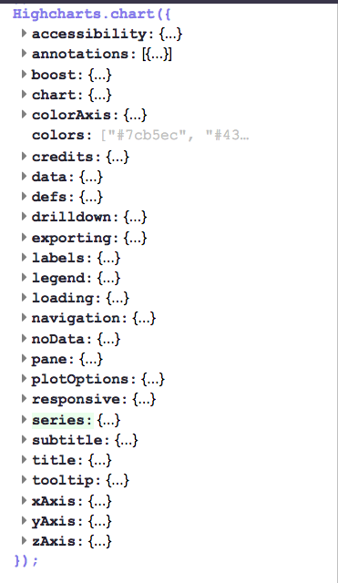
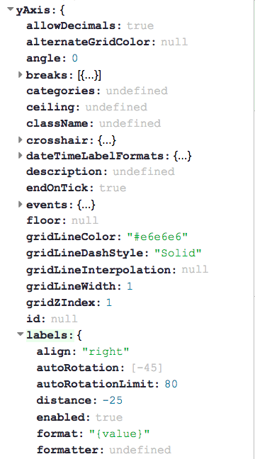

```{r setup, include=FALSE}
knitr::opts_chunk$set(echo = TRUE)
```

```{r libs, message = FALSE, include=FALSE}
# devtools::install_github("hadley/emo")
library(emo)
library(tidyverse)
library(highcharter)
load("data/538comics.RData")
load("data/candy.RData")
```


## Intro

Hello, I am María Paula Caldas `r ji("wave")`

I am an economist, currently working as a consultant at Deloitte. My work involves a healthy mix of __economics__, __data analysis__ and __data visualization__. 

For one of my cooler projects, I got to explore the `highcharter` package. My goal today is to introduce you to the package and to share with you some of the lessons I learned.

Please don't hesitate to ask questions `r ji("raising_hand_woman")`

# Interactive visualizations

## Interactive vs static visualisations

```{r, echo=FALSE}
hchart(
  ggplot2::mpg, 
  "scatter", 
  hcaes(x = displ, y = hwy, group = class)
  )
```

## Packages for interactive visualizations

Most R packages for interactive data visualizations are powered by `htmlwidgets`: a R package that provides a framework for creating R bindings to JavaScript libraries. 

Here are some of the packages you may have heard about: 

- `plotly`
- `DiagrammeR`
- `leaflet`
- `networkD3`
- `highcharter`

## Highcharts & `highcharter`

`highcharter` is a R wrapper for the __Highcharts__ JavaScript charting library and its modules.

Some of the nice features of the package include:

- `hchart()` function 
- Layering syntax + use of `magrittr` pipes (`%>%`)
- 10+ built-in themes
- Support for __Highstock__ and __Highmaps__ charts
- Implementation of other Highcharts plug-ins

Please keep in mind that __Highcharts__ is a software product that is _not_ free for commercial and Governmental use.

# Building charts with `highcharter`

## `highcharter` vs `ggplot2`

> - Both allow you to create highly customizable visualizations
> - Both build plots by layers
>     - `ggplot2` with `+`
>     - `highcharter` with `%>%`
> - `ggplot2` is useful both for __exploration__ and __presentation__
> - `highcharter` is better suited for dynamic visualizations in __Shiny__ or __RMarkdown__ documents
> - You can access the majority of the documentation for `ggplot2` directly via R/R Studio, you will have to look through the [Highcharts API](https://api.highcharts.com/highcharts/) for details on function parameters
>     - Joshua Kunst (package maintainer) more than makes up for this with his detailed package website, vignettes and blog posts

## How do you start a plot?

There are two ways to start a plot: 

> - `hchart()`, similarly to ggplot2's `qplot()`, is meant for making quick charts with minimal information from the user

> - `highcharter()` followed by either one of two functions:
>     - `hc_add_series()`
>     - `hc_add_series_list()`

> - Both `hchart()` and `hc_add_series()` accept an aesthetic mapping function _à la ggplot2_: `hcaes()`

## An example {.smaller}

I am going to recreate a plot that appeared in one of FiveThirtyEight's articles: [Comic Books Are Still Made By Men, For Men And About Men](https://fivethirtyeight.com/features/women-in-comic-books/). The data are available at [Github](https://github.com/fivethirtyeight/data/tree/master/comic-characters). 

Here is a glimpse of the data that we will use in the next charts:

```{r}
new_fem_per_year
```


## `hchart()` {.smaller}

```{r hchart-comics}
hc1 <- hchart(
  new_fem_per_year, 
  "line",
  hcaes(x = year, y = share_gender, group = comic), 
  color = c("#518cca", "#e23636")
  ) %>% 
  hc_title(text = "Comics Aren't Gaining Many Female Characters") %>% 
  hc_subtitle(text = "Percentage of new characters who are female") %>% 
  hc_xAxis(title = list(text = "")) %>% 
  hc_yAxis(
    title  = list(text = ""), 
    labels = list(format = "{value} %")
  ) %>% 
  hc_tooltip(
    pointFormat = "{series.name}: <b>{point.y}</b><br/>", 
    shared = TRUE,
    valueSuffix = " %", 
    crosshairs = TRUE
  ) %>% 
  hc_add_theme(hc_theme_538())
```

---

```{r}
hc1
```


## `hc_add_series()` {.smaller}

```{r hc_add_series-comics}
hc2 <- highchart() %>% 
  hc_add_series(
    data = new_fem_per_year, 
    type = "line", 
    hcaes(x = year, y = share_gender, group = comic),
    color = c("#518cca", "#e23636"),
    marker = list(enabled = FALSE) # not needed in hchart()
  ) %>% 
  hc_title(text = "Comics Aren't Gaining Many Female Characters") %>% 
  hc_subtitle(text = "Percentage of new characters who are female") %>% 
  hc_xAxis(title = list(text = "")) %>% 
  hc_yAxis(
    title  = list(text = ""), 
    labels = list(format = "{value} %")
    ) %>% 
  hc_tooltip(
    pointFormat = "{series.name}: <b>{point.y}</b><br/>", 
    shared = TRUE,
    valueSuffix = " %", 
    crosshairs = TRUE
  ) %>% 
  hc_add_theme(hc_theme_538())
```

---

```{r}
hc2
```

## Chart types

<div class="centered">
[](https://api.highcharts.com/highcharts/series)
</div>

## Style options | Functions {.smaller}

<div class="columns-2">

```{r, out.height="400px", echo=FALSE, fig.align='center'}

```

Options that modify the graphical parameters of the plot start with `hc_`. For example: 

- `hc_title()`
- `hc_xAxis()`
- `hc_tooltip()`

## Style options | Parameters {.smaller}

<div class="columns-2">

```{r, out.height="400px", echo=FALSE, fig.align='center'}

```

The parameters inside the `hc_` function family are also defined in the API.

Note that some options may have additional sub-options. To set these, you will have to used __named lists__

```
hc_yAxis(
  title  = list(text = ""), 
  labels = list(format = "{value} %")
  ) 
```

</div>

## Good-to-knows | The tooltip {.smaller}

- The tooltip is a great way of conveying secondary information in your graphs.
- The function `tooltip_table()` helps you make quick HTML tables that can be passed to the `pointFormat` argument of `hc_tooltip()`

Here is an example of the tooltip I created for the following chart. I named this object `tltip`

```{r}
left <- c("heart_eyes", "neutral_face", "sob") %>% map_chr(emo::ji) 
right <- sprintf("{point.%s}", c("JOY", "MEH", "DESPAIR"))

tltip <- tooltip_table(left, right)
```

## {.smaller}

```{r candy_feelies, echo=FALSE}
candy_feelies <- candy %>% 
  filter(other_candy != 1) %>% 
  group_by(id) %>% 
  mutate(n = n()) %>% 
  filter(n == max(n)) %>% # only keep info of those that answered everything
  ungroup() %>% 
  count(candy, feelies) %>% 
  spread(feelies, nn) %>% 
  mutate(
    net_feelies = JOY - DESPAIR,
    color = ifelse(net_feelies >= 0, "#E86A04", "#020200")
    # color = 1*(net_feelies >= 0)
    ) %>% 
  arrange(desc(net_feelies))
```


```{r candy}
hc3 <- hchart(
  candy_feelies, 
  "area", 
  hcaes(x = candy, y = net_feelies),
  threshold = 0,
  color = "orange",
  negativeColor = "black",
  marker = list(enabled = FALSE)
  ) %>% 
  hc_chart(inverted = TRUE) %>% 
  hc_xAxis(
    title = list(text = ""), 
    opposite = TRUE, 
    tickLength = 0
    ) %>% 
  hc_yAxis(
    title = list(text = "Net feelies = Joy - Despair")
    ) %>% 
  hc_tooltip(useHTML = TRUE, pointFormat = tltip) %>% 
  hc_title(text = "Halloween Candy Hierarchy", align = "left") %>% 
  hc_credits(
    enabled = TRUE,
    text = "Source: UBC - THE SCIENCE CREATIVE QUARTERLY", 
    href = "https://www.scq.ubc.ca/so-much-candy-data-seriously/"
  ) %>% 
  hc_add_theme(hc_theme_elementary())
```

---

```{r}
hc3
```

## Good-to-knows | Facetting {.smaller}

Not automatically possible like in `ggplot2`, but you can get around it using `purrr::map()` and `hw_grid()`.

Here's another example using FiveThirtyEight's data. 

```{r}
str(new_char_per_year)
```

## {.smaller}

```{r facet}
make_bars <- function(p){
  
  tltip <- tooltip_table("Characters", "{point.n}")
  
  couleur <- unique(p$couleur)
  titre   <- unique(p$titre)
  
  hchart(
    p,
    "column",
    hcaes(x = year, y = n), 
    showInLegend = FALSE, 
    color = couleur
    ) %>% 
    hc_add_theme(hc_theme_538()) %>% 
    hc_yAxis(title = list(text = ""), max = 560) %>% 
    hc_xAxis(title = list(text = "")) %>% 
    hc_title(text = titre) %>% 
    hc_tooltip(useHTML = TRUE, pointFormat = tltip)
}

hc4 <- new_char_per_year %>% 
  map(make_bars) %>% 
  hw_grid(ncol = 2, rowheight = 400) %>% 
  htmltools::browsable()
```

---

```{r, echo = TRUE}
hc4
```


# Other resources

## Useful links {.smaller}

Official websites:

- [Highcharter package](http://jkunst.com/highcharter/)
- [Highcharts API](https://www.highcharts.com/)
    - [API Options Reference](https://api.highcharts.com/highcharts/)

Blog posts: 

- [Joshua Kunst's blog](http://jkunst.com/blog/) (maintainer of the package)
- [Thinking in highcharter: How to build any Highcharts plot in R](https://dantonnoriega.github.io/ultinomics.org/post/2017-04-05-highcharter-explainer.html)
- [Creating interactive plots with R and Highcharts](https://rviews.rstudio.com/2016/10/19/creating-interactive-plots-with-r-and-highcharts/)
- [Making a Shiny dashboard with Highcharter](https://datascienceplus.com/making-a-shiny-dashboard-using-highcharter-analyzing-inflation-rates/)

Misc: 

- For more on `hchart()` vs `hc_add_series()` check out the discussion on [issue #302 at Github](https://github.com/jbkunst/highcharter/issues/302) on Github.
- And on faceting, see discussion [here](https://github.com/jbkunst/highcharter/issues/66) and example [here](http://rpubs.com/jbkunst/higcharter-grid-test)

# Thank you! | Any questions?


